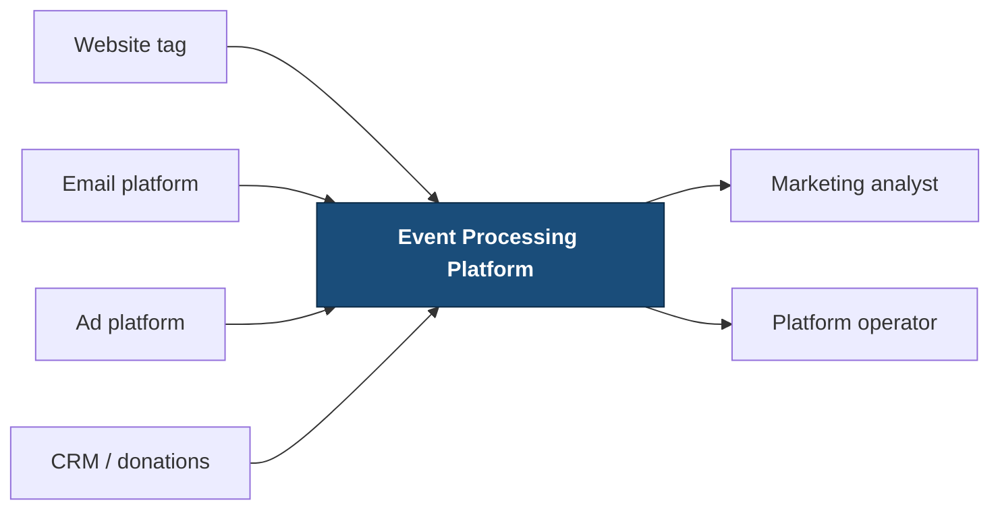

# Architecture

Multi-tenant distributed event processing platform. Structured as **arc42-lite**; diagrams
are C4 via Mermaid; decisions are Nygard-form ADRs linked in §13.

---

## 1. Executive Summary

A backend platform that ingests high-volume marketing and website events for a multi-tenant
nonprofit and association marketing product, stores them immutably, and serves four read
paths: filtered listing, time-bucketed aggregation, metadata search, and a cached live
summary.

The five choices that shape everything else:

1. **Accept, then store.** `POST /events` validates and enqueues, returning `202` without
   waiting for persistence. Ingestion latency is decoupled from storage latency.
2. **At-least-once delivery with idempotent consumption.** Exactly-once delivery is not
   available. Exactly-once *effects* are, via a unique `(tenant_id, event_id)` index —
   which matters because a double-counted donation is a wrong number on a fundraising
   report (ADR-002).
3. **MongoDB is canonical; Elasticsearch and Redis are derived.** Both can be dropped and
   rebuilt. Neither is allowed to fail a request (ADR-003).
4. **Tenant isolation is structural, not procedural.** The tenant comes from a credential
   the caller cannot forge, and `TenantContext` is a required argument on every port method
   — so a forgotten scope is a type error, not a data leak (ADR-004).
5. **Modular monolith with hexagonal boundaries**, enforced by a build-failing import
   contract. This is what makes the SQS migration an adapter swap rather than a claim
   (ADR-001, ADR-007).

**126 tests pass** across unit, integration, contract, and architecture suites. Integration
tests run real MongoDB, Elasticsearch, and Redis via Testcontainers. `uv run pytest` runs
everything.

---

## 2. Business Context and Assumptions

**The product.** Nonprofits, associations, and chapters run campaigns to drive engagement
and measurable outcomes. A visitor arrives anonymously from an ad or an email, views pages,
clicks, registers for a conference, later donates, and eventually renews. The platform
records those touchpoints per organisation and answers questions about them.

**Multi-tenancy is the central constraint.** Each customer is a distinct organisation whose
data includes constituent behaviour and donation activity. Cross-tenant disclosure is not a
bug to fix next release; it is the failure that ends the relationship.

**Assumptions**

- Senders are systems (tags, email platforms, ad platforms, CRMs), not humans.
- Anonymous and known identity are independent, and the platform does not resolve one to
  the other. That is a downstream identity graph's job; inventing the link here would
  fabricate observations.
- Events are collected under the customer's own lawful basis. Consent signals are captured
  faithfully and **not acted upon** by the platform.
- Volume targets — 1,000 events/second, 10M stored events — were chosen an order of
  magnitude above what a review environment needs, so the design has to reason about scale
  rather than trivially satisfy it.

**Non-goals, explicitly.** No frontend. No real ad-network or CRM integrations. No identity
graph. No claim of exactly-once delivery. No retention, archival, or erasure workflow — the
most significant gap for this domain, named in §12 and `docs/threat-model.md`.

**Two decisions made during specification** (`specs/001-distributed-event-platform/spec.md`)

- **D1 — tenant from an opaque credential**, not a header. A spoofable header would make
  the isolation tests prove scoping but not authorization.
- **D2 — `event_id` sender-supplied when present, platform-generated when absent.** Sender
  retries are the dominant real duplicate source. The accepted cost: a sender that omits an
  id and retries produces two events, which is why the response carries `event_id_origin`
  and `docs/event-contract.md` tells senders to supply their own.

---

## 3. Goals and Quality Attributes

| Attribute | Target | Status |
|---|---|---|
| Ingestion latency | p95 < 100 ms at 1,000 events/s | Design target — **not load-tested** |
| Correctness under redelivery | Exactly one record per `(tenant, event_id)` | ✅ verified |
| No silent loss | accepted = stored + dead-lettered | ✅ verified |
| Tenant isolation | Zero cross-tenant records on every read path | ✅ verified |
| Graceful degradation | Redis or Elasticsearch down ⇒ degraded, not failed | ✅ verified |
| Search freshness | 95% indexed within 5 s | 📊 observable |
| Query latency | Listing p95 < 500 ms, aggregation < 2 s at 10M | **Not measured** |
| Operability | Every signal readable from `/metrics` | ✅ verified |
| Reproducibility | One command runs everything | ✅ verified |

Full scenarios, and an explicit account of what was **not** measured, in
`docs/quality-scenarios.md`.

---

## 4. Constraints

**Fixed by the assignment.** Python; FastAPI; MongoDB as the primary store; Elasticsearch
for search; Redis for caching; a simulated in-process queue; backend only; one week.

**Chosen, with the reasoning recorded**

- **Python 3.13**, pinned identically in `pyproject.toml`, the image, and CI.
- **PyMongo 4.17 `AsyncMongoClient`, not Motor.** Motor passed its deprecation date on
  2026-05-14; adopting a driver already past deprecation would be a defect in a submission
  whose constitution requires current supported versions.
- **MongoDB 8.2, not 8.0.** MongoDB 8.0 refuses to start on Linux kernel 6.19+, which
  current Docker Desktop VMs run (SERVER-121912). Found by running it.
- **MongoDB standalone, no replica set.** This design uses no transactions and no change
  streams, so a replica set would be ceremony with nothing behind it (ADR-005).
- **RabbitMQ alongside the in-process queue.** Two live adapters behind one port turn
  "SQS is a third adapter" from a claim into an observation (ADR-007).

---

## 5. System Context

Full diagram: [`docs/diagrams/system-context.md`](docs/diagrams/system-context.md)



Every sender is untrusted and arrives over the public internet. The tenant is resolved from
a credential; no request field names one.

---

## 6. Solution Strategy

| Driver | Consequence |
|---|---|
| Async, low-latency ingestion | Return `202`; queue before durable processing; no database write on the request path |
| At-least-once delivery | Immutable `event_id`, unique MongoDB index, idempotent worker, ack after persist |
| MongoDB canonical | Persist before processing is considered complete; derived stores never gate it |
| Elasticsearch for metadata search | Asynchronous projection with recorded state and a reconciler |
| Redis for the live endpoint | Cache-aside, tenant-and-filter-aware keys, bounded staleness, degraded fallback |
| Multi-tenancy | `tenant_id` in envelope, every index, every query, every cache key; `TenantContext` required on every port method |
| Marketing domain | Campaign, channel, source, visitor/contact, and conversion dimensions in the envelope |
| One-week timebox | Modular monolith; Compose; production evolution documented rather than built |

**Why the write path is ordered as it is.** Validate → enqueue → `202` → consume → persist
→ **ack** → project → reconcile. Two orderings are load-bearing: acknowledging only after
persistence (otherwise a worker crash loses events), and projecting only after
acknowledgement (otherwise an Elasticsearch outage becomes an ingestion outage).

---

## 7. Container and Component Views

Containers: [`docs/diagrams/container.md`](docs/diagrams/container.md) ·
Components: [`docs/diagrams/component.md`](docs/diagrams/component.md)

### Responsibilities

| Container | Owns | Explicitly does not own |
|---|---|---|
| **API** | Validation, tenant resolution, enqueueing, read endpoints, rate limiting, backpressure | Persistence, projection, retry |
| **Worker** | Consuming, idempotent persistence, acknowledgement, projection, reconciliation | HTTP, request validation |
| **Queue** | Pending delivery state, visibility timeout, redelivery, capacity | Long-term storage |
| **MongoDB** | Canonical events, idempotency constraint, projection state, dead letters, tenants | Search relevance, cached summaries |
| **Elasticsearch** | Searchable projection | Canonical truth |
| **Redis** | Cached summaries, single-flight locks, rate counters | Any durable business data |

### The hexagonal boundary

```
api / worker  →  application  →  ports  ←  infrastructure
                                   ↓
                                 domain          (imports nothing)
```

`domain` imports no framework, no driver, and not even
`eventplatform.infrastructure`. Enforced by `.importlinter` and
`tests/architecture/test_boundaries.py`, both of which fail the build.

**This caught a real problem.** During implementation the contract flagged
`worker/main.py` importing the composition root from `api/dependencies.py` — a coupling
that reads as harmless in review. `eventplatform/composition.py` exists at the package root
as a result, and both entry points now compose the same graph without either depending on
the other.

### Two structural guarantees

**`EventRepository` exposes no `update` and no `delete`.** Event immutability is enforced by
the method not existing. A test asserts the methods stay absent.

**Every tenant-touching port method takes `tenant: TenantContext` first.** No ambient
context, no default. This is the strongest available enforcement of isolation, and the
verbosity is the mechanism rather than a side effect.

---

## 8. Runtime Scenarios

All sequences: [`docs/diagrams/ingest-sequence.md`](docs/diagrams/ingest-sequence.md).
Behaviour below is observed, not predicted — each maps to a passing test.

**Successful ingestion.** Validate → enqueue → `202` → consume → insert → ack → project →
mark indexed. ✅ `test_the_whole_pipeline`

**Duplicate delivery.** `DuplicateKeyError` → compare `content_hash` → suppressed (match) or
conflict (differ, first kept) → acknowledge either way. Non-zero suppression is the system
working, not failing. ✅ `test_triplicate_delivery_single_record`,
`test_concurrent_duplicates_cannot_both_insert`

**MongoDB outage.** Not acknowledged → exponential backoff with full jitter → after 5
attempts, dead-lettered with payload, reason, attempts, and timings, then replayable. ✅
`test_retry_then_dead_letter`, `test_dead_letter_replay`

**Elasticsearch failure.** Event stored and fully retrievable; `projection.status = failed`;
search returns an explicit 503; the reconciler re-indexes once Elasticsearch returns. ✅
`test_reconciler_repairs_the_projection_once_search_returns`

**Redis failure.** Live summary computed from MongoDB, marked `degraded: true`. The endpoint
never fails because a derived store is down. ✅ `test_cache_unavailable_degrades`

**Cache hit, miss, stampede.** Miss recomputes and stores under a single-flight lock; hit
returns with `cached: true` and `age_seconds`; expiry recomputes. ✅
`test_cache_miss_then_hit`, `test_ttl_expiry_forces_recomputation`

**Querying before convergence.** `GET /events` sees an event before `GET /events/search`
does. The search response carries an explicit `freshness_note` rather than implying the
event does not exist.

**Poison message.** Dead-lettered immediately, not retried — a payload that cannot parse
never will, and retrying it burns attempts and blocks the batch behind it. ✅
`test_poison_message_is_dead_lettered_immediately`

**Backpressure.** Queue at capacity → `503` with `Retry-After`, no receipt issued. Accepted
count equals queue depth: nothing is accepted and then discarded. ✅
`test_backpressure_returns_503`

---

## 9. Data Architecture

Full detail: [`docs/data-model.md`](docs/data-model.md) ·
[`docs/event-contract.md`](docs/event-contract.md)

### Ownership

| Store | Owns | Consistency | Rebuildable from |
|---|---|---|---|
| MongoDB | Canonical events, idempotency, projection state, dead letters, tenants | Source of truth | nothing |
| Elasticsearch | Searchable projection | Eventually consistent | MongoDB |
| Redis | Cached summaries, locks | Bounded stale (30 s) | MongoDB |

### MongoDB indexes, and what is deliberately absent

| Index | Serves |
|---|---|
| `{tenant_id, event_id}` **unique** | Idempotency — the guarantee itself |
| `{tenant_id, occurred_at:-1}` | Default listing, every bounded-range aggregation |
| `{tenant_id, event_type, occurred_at:-1}` | Type filter + range; the stats pipeline |
| `{tenant_id, identity.contact_id, occurred_at:-1}` sparse | Known-identity lookups |
| `{tenant_id, identity.anonymous_id, occurred_at:-1}` sparse | Anonymous lookups |
| `{projection.status, projection.updated_at}` partial | The reconciler only |

**Not indexed, on purpose** — indexing everything is not a performance strategy, it is a
write tax:

- **`source_url`** — high cardinality, low selectivity within a tenant; queries using it
  almost always pair with a type or range filter an existing index already serves.
- **`campaign_id`** — same argument today; the first index to add when campaign-scoped
  reporting becomes a first-class access pattern.
- **`metadata.*`** — schemaless by contract, so indexing means either an unbounded index set
  or a wildcard index with unpredictable selectivity. Metadata search is Elasticsearch's
  job; that division is the entire justification for having Elasticsearch.
- **TTL for retention** — would silently delete canonical events, breaking immutability.

**Pagination is keyset, not skip.** `skip` costs time linear in the offset, so deep pages
degrade exactly when a customer exports the most data. The cursor encodes
`(occurred_at, event_id)`; including `event_id` gives total ordering when timestamps tie —
and they do, because event traffic clusters. ✅
`test_inserting_newer_events_mid_walk_causes_no_skip_or_repeat`

### Elasticsearch mapping

`dynamic: strict`, so an unmapped field is a loud error rather than a silent mapping
addition. Exact-match dimensions are `keyword`; `source_url` is `keyword` with a `.text`
sub-field.

**Customer metadata maps to a single `flattened` field.** This is the decision that makes
Principle VII.7 achievable without rejecting customer data: a customer inventing a thousand
metadata keys produces **one** mapping entry, not a thousand. ✅
`test_metadata_with_many_keys_does_not_explode_the_mapping` indexes 20 distinct custom keys
and asserts the mapping has one `metadata` property.

**The trade-off, stated.** `flattened` indexes every value as a keyword — no range queries,
no per-field analysis inside it. That is why an allowlisted `metadata_text` copy sits
alongside for full-text search.

### Redis keys

`v1:{tenant_id}:stats:rt:{sha256(normalized_filters)[:16]}`, TTL 30 s.

The tenant is a **literal segment**, not part of the hash, so an operator reading Redis by
hand can see who owns a key. Every filter affecting the response is inside the hash, so two
distinct requests cannot collide onto one entry.

### PII

No raw IP is stored — only a hash. No payload or metadata reaches logs (a structlog
processor drops a fixed key set). Cache keys hold only a tenant and a filter hash.

---

## 10. Cross-Cutting Concerns

**Authentication.** Opaque bearer credential → SHA-256 hash → tenant. Plaintext exists once,
at issuance. Unknown and revoked are indistinguishable, so keys cannot be enumerated.

**Authorization.** The tenant boundary is the entire model. Any credential for a tenant can
do everything that tenant can — roles and scopes are production work, named as a non-goal.

**Observability.** [`docs/observability.md`](docs/observability.md). Structured JSON logs
with `request_id`, `tenant_id`, `event_id`, `worker_id`. Redaction drops a fixed sensitive
key set wholesale rather than masking, because a masked value still leaks length and shape.

**Configuration.** Environment only. `.env.example` carries names and safe placeholders,
never values.

**Input safety.** Schema validation with extras forbidden; metadata bounded at 16 KB / 3
levels / 50 keys; `occurred_at` bounded to −90 days / +5 minutes; page size capped at 200;
aggregate ranges clamped with the clamp reported back.

**Search safety.** No raw DSL is accepted, and there is no parameter through which a caller
could supply one. Queries use `multi_match`, never `query_string`, so operators in caller
input are not parsed. ✅ `test_raw_dsl_is_literal` runs four hostile inputs including
`") OR tenant_id:tenant_b OR ("`.

**Threat model.** [`docs/threat-model.md`](docs/threat-model.md) — STRIDE-lite, each row
mapped to its mitigation and its test.

---

## 11. Deployment View

`docker compose up --build` starts api, worker, mongodb, elasticsearch, redis, rabbitmq.

Three details that matter and are easy to get wrong:

- **`condition: service_healthy`**, not bare `depends_on`. Bare `depends_on` waits only for
  the container to *start*, so the API races Elasticsearch's boot and crash-loops.
- **Elasticsearch `Xms` equals `Xmx`, under half the container limit.** Otherwise the JVM
  fights the cgroup and the OOM killer wins.
- **MongoDB standalone.** No replica set, because nothing here needs transactions or change
  streams — which also removes an init container and a class of startup race.

Health checks: `mongosh --eval "db.adminCommand('ping').ok"`, Elasticsearch `_cluster/health`
accepting green **or yellow** (single node is yellow by design), `redis-cli ping`,
`rabbitmq-diagnostics -q check_running`.

**Toward production.** Managed stores (Atlas, OpenSearch, ElastiCache), SQS replacing the
queue adapter, API and worker as separate scalable services, shared Redis rate limiting,
secrets from a secret manager, and TLS between components.

---

## 12. Risks, Scaling, and Future Evolution

### What breaks first at 10×

At 10,000 events/second and 100M stored events, in the order failures actually arrive:

1. **Elasticsearch indexing throughput.** One document per event is the most expensive
   per-event operation in the pipeline. → Bulk the projection in size-and-time-bounded
   batches, then move it to a dedicated consumer group.
2. **MongoDB write amplification from five indexes.** Every insert updates five B-trees. →
   Shard on `tenant_id`, which the leading-`tenant_id` index design already prepares for;
   review the two identity indexes against real access patterns.
3. **The aggregation pipeline.** Scanning a month of events per dashboard load stops being
   viable. → Pre-aggregated rollups maintained by the worker, with the raw pipeline retained
   for backfill and correction.
4. **Redis single-key contention** on popular summaries. → Single-flight already blunts it;
   beyond that, shard summary keys by time bucket.
5. **The single worker process**, throughout. → Horizontal scaling is the first lever and is
   already safe: idempotency means adding consumers needs no coordination.

### Highest risks today

1. **In-process queue loses accepted events on restart.** The most important limitation in
   the system. ADR-007 is the fix; RabbitMQ already implements it.
2. **No retention or erasure workflow.** Constituent data with no deletion path — the most
   significant gap for this domain.
3. **Per-replica rate limiting.** The effective limit multiplies by replica count.
4. **Single-node stores in Compose.** Node loss is data loss for MongoDB.

### What I would do differently with more time

**Load-test before claiming latency.** The p95 targets in §3 are design targets and are
labelled as such. The metrics to measure them are exposed; the measurement was not taken,
and I would rather say so than present unverified numbers as results.

**Build the real outbox.** ADR-005's status field plus reconciler recovers every failure
mode, but the insert and the projection attempt are still separate operations. A
transactional outbox with a change-stream reader closes the window properly — and brings
back the replica set that this design deliberately dropped.

**Build retention and erasure.** The highest-value missing feature for this domain, not the
most interesting one.

**Shared rate limiting.** Move the token bucket to Redis so the limit means something across
replicas.

**Rollups.** Item 3 above is the first scaling wall the product would actually hit, because
dashboards poll far more often than events arrive.

---

## 13. ADR Index

| ADR | Decision |
|---|---|
| [ADR-001](docs/adr/ADR-001-modular-monolith.md) | Modular monolith with hexagonal boundaries |
| [ADR-002](docs/adr/ADR-002-at-least-once-idempotency.md) | At-least-once delivery, consumer-side idempotency |
| [ADR-003](docs/adr/ADR-003-storage-responsibilities.md) | MongoDB canonical; Elasticsearch and Redis derived |
| [ADR-004](docs/adr/ADR-004-tenant-isolation.md) | Structural tenant isolation across storage, query, cache |
| [ADR-005](docs/adr/ADR-005-projection-reliability-and-outbox.md) | Projection status + reconciler; outbox as evolution |
| [ADR-006](docs/adr/ADR-006-cache-aside-bounded-staleness.md) | Cache-aside with bounded staleness |
| [ADR-007](docs/adr/ADR-007-queue-migration-to-sqs.md) | In-process queue → SQS migration path |

**Supporting documents.** [`docs/event-contract.md`](docs/event-contract.md) ·
[`docs/data-model.md`](docs/data-model.md) ·
[`docs/failure-modes.md`](docs/failure-modes.md) ·
[`docs/quality-scenarios.md`](docs/quality-scenarios.md) ·
[`docs/observability.md`](docs/observability.md) ·
[`docs/threat-model.md`](docs/threat-model.md) ·
[`docs/diagrams/`](docs/diagrams/)
