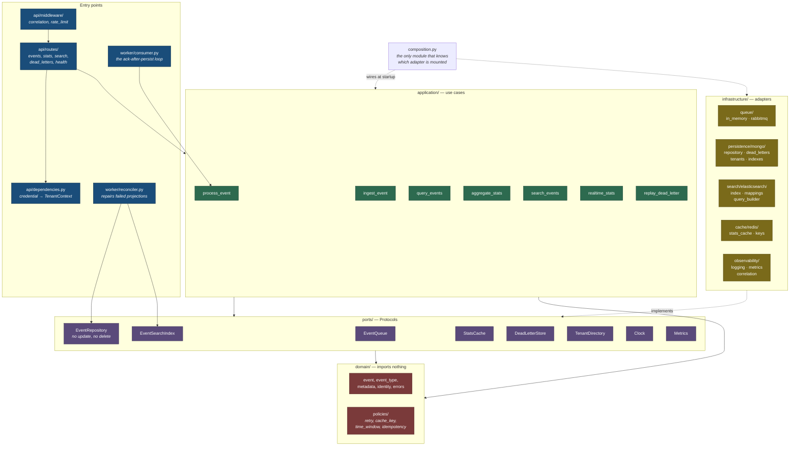

# C4 Level 3 — Components

The hexagonal boundary, as it exists in the directory tree.

## The rule, and what enforces it

Every arrow points inward. `domain` imports nothing — not FastAPI, not a driver, not even
`eventplatform.infrastructure`. `application` reaches infrastructure only through
`ports`, which are `Protocol`s, so an adapter never imports the port it satisfies.

This is checked, not asserted. `.importlinter` defines two contracts and
`tests/architecture/test_boundaries.py` runs them plus an AST scan. Both fail the build on
violation. During implementation the contract caught `worker/main.py` importing the
composition root from `api/dependencies.py`; `composition.py` exists at the package root
because of that finding.

## Two structural details that carry guarantees

**`EventRepository` has no `update` and no `delete`.** Event immutability is enforced by
the method not existing, rather than by a rule someone must remember.
`update_projection` is the single narrow exception and touches only projection state.

**Every tenant-touching port method takes `tenant: TenantContext` first.** No ambient
context, no default. A forgotten scope is a type error at authoring time (ADR-004).
