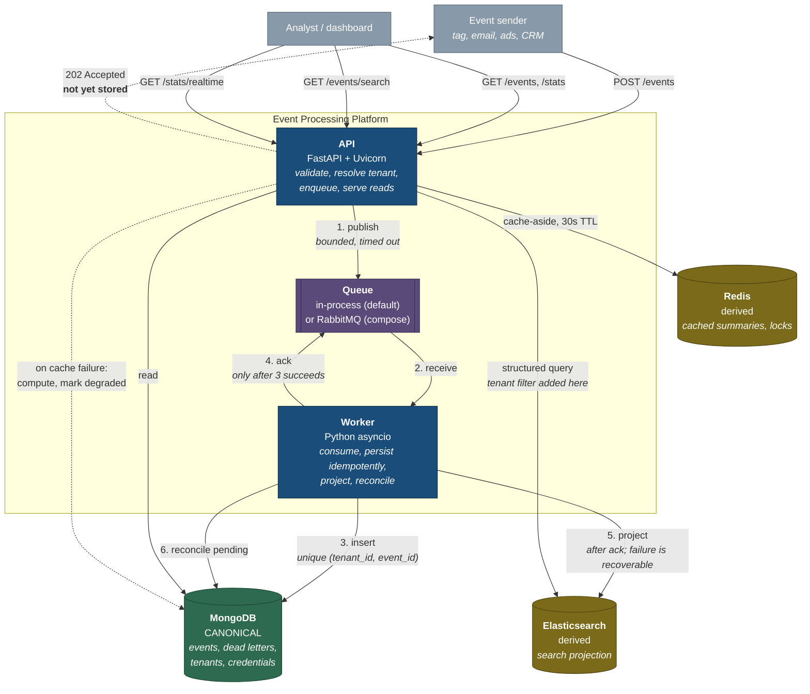

# C4 Level 2 — Containers

What runs, what stores state, and which arrows are on the critical path.

## Ordering that is load-bearing

**Step 4 after step 3, never before.** The queue message is acknowledged only once the
canonical record is confirmed stored. Reversing these loses events on a worker crash.

**Step 5 after step 4, never before.** Projection happens after acknowledgement, so an
Elasticsearch outage delays search without stalling ingestion (ADR-003). Step 6 is the
recovery path for step 5 failing (ADR-005).

**The dotted 202 is the whole point of the design.** It returns before steps 3–5 have
happened, which is why the response says `accepted` and the API description states plainly
that it does not mean stored.

## Colour key

Green is canonical and cannot be rebuilt. Amber is derived: both stores can be dropped and
rebuilt from MongoDB, and the test suite does exactly that between runs.
