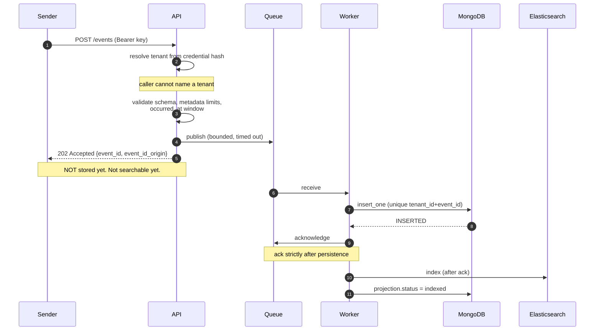
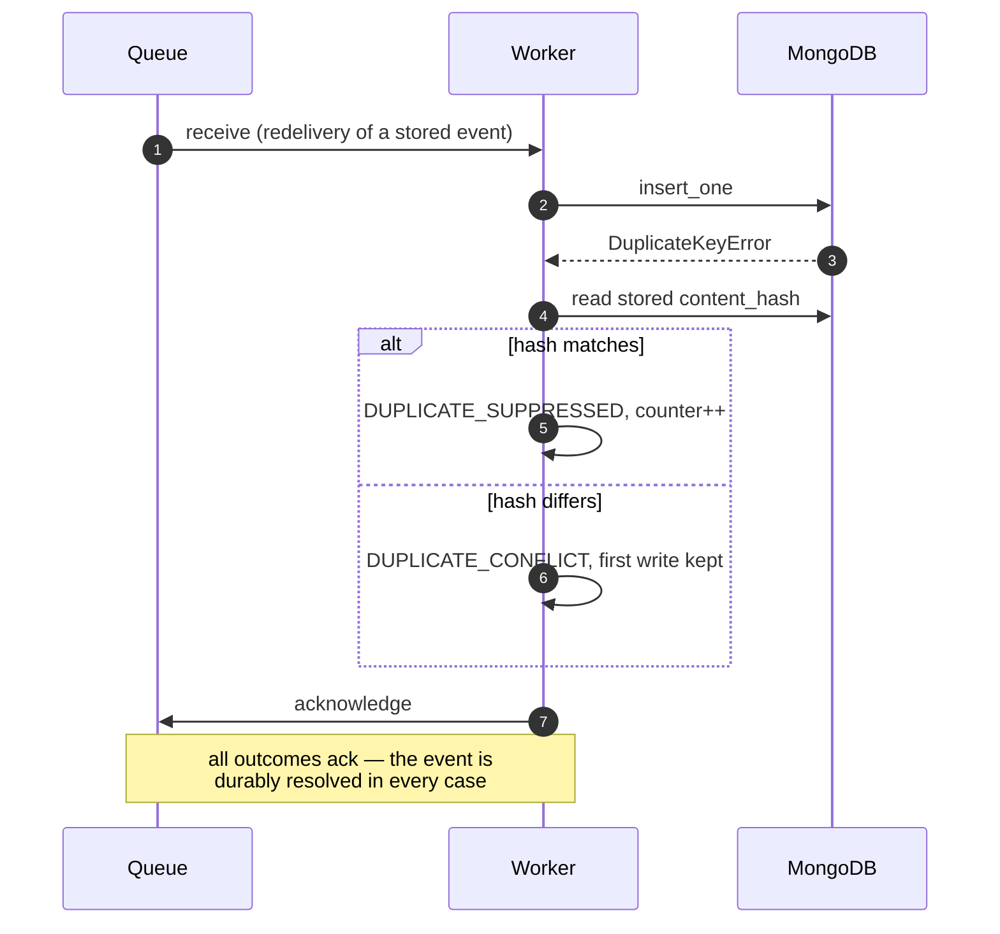
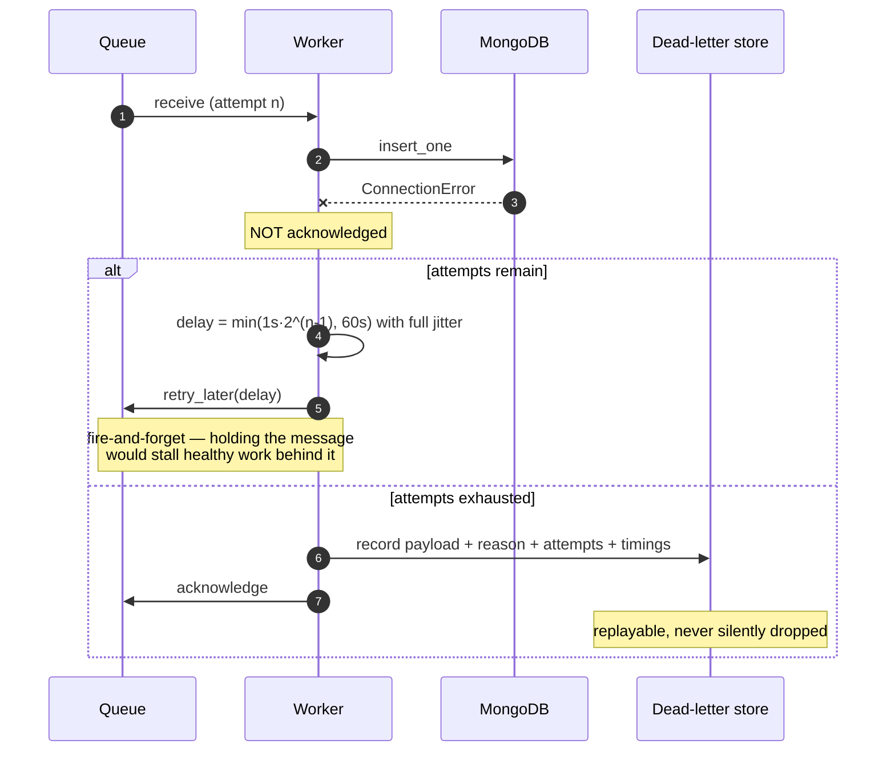
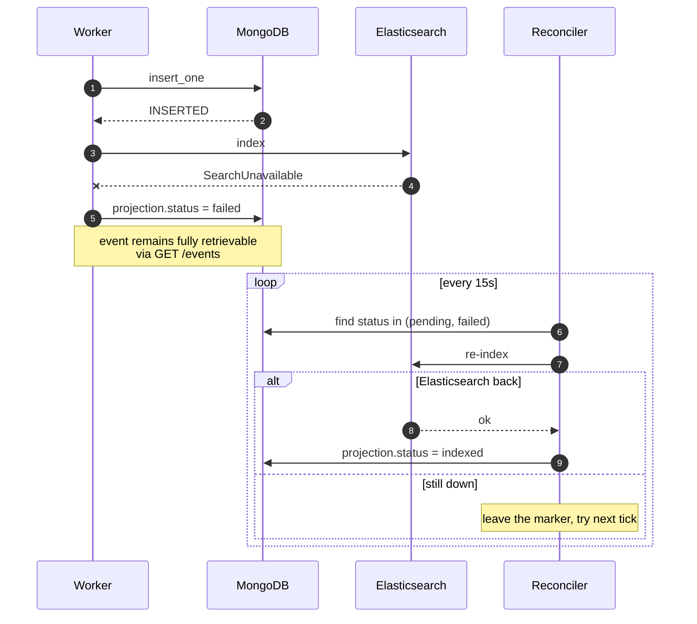
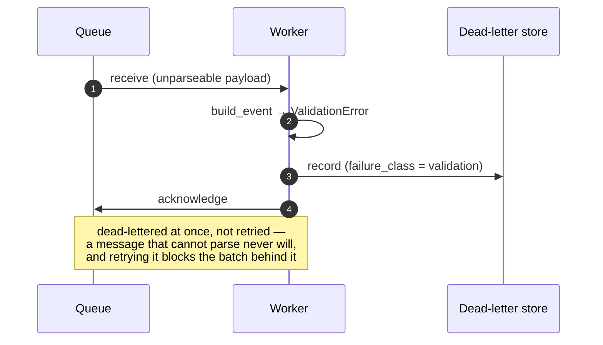
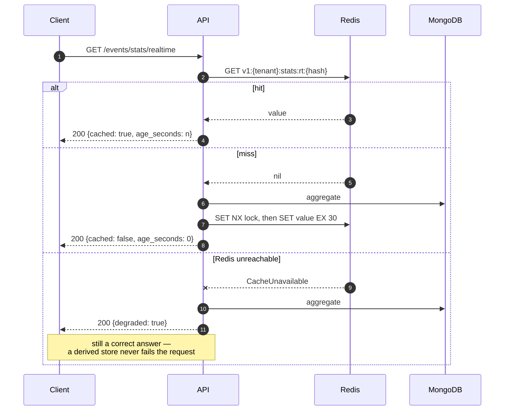

# Ingestion and Failure/Retry Sequences

## Success path

## Duplicate delivery

## MongoDB unavailable: retry, then dead-letter

## Elasticsearch unavailable: the event survives

## Poison message

## Cache miss, hit, and failure

