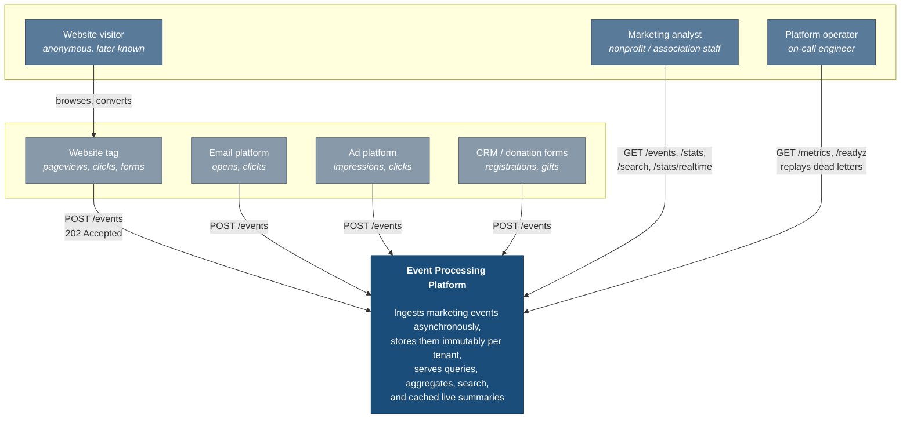

# C4 Level 1 — System Context

Who uses the platform, what sends it events, and what it depends on.

## Boundaries worth stating

**Every sender is untrusted.** Events arrive over the public internet from tags a customer
installed on their own site. Payloads are schema-validated, size-bounded, and depth-bounded
before they enter the queue.

**Tenant comes from the credential, never the payload.** Each sender holds an opaque API
key mapped server-side to exactly one organisation (ADR-004). No request field names a
tenant.

**Out of scope, deliberately.** No frontend. No real ad-network or CRM integration — those
are event sources, not systems we call. No identity-resolution graph joining anonymous
visitors to known contacts; the platform stores both identifiers faithfully and leaves the
join to a downstream system.
